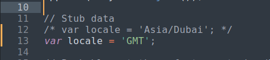

# Calend# Calendar Reserver (AngularJS)

Calendar Reserver is a front-end application developed as a hiring task for Stellic Inc.


## Table of Contents

- [Libraries Dependency](#libraries-dependency)
- [How to run?](#how-to-run)
- [Project Structure](#project-structure)
- [Changes in Server](#changes-in-server)
- [Contributing](#contributing)
- [Credits](#credits)
- [License](#license)


## Libraries Dependency
 -   "@popperjs/core": "^2.9.3",
 -   "angular": "1.4",
 -   "bootstrap": "^5.1.0",
 -   "http-server": "^13.0.1",
 -   "moment": "^2.29.1",
 -   "moment-timezone": "^0.5.33"


**For proper execution of this project, it needs a running server. The server's repository can be found [here.](https://bitbucket.org/mpopatia/reservation-calendar/src/master/)**

Q: How can you get these libraries? 

A: Using the [npm](https://github.com/npm/npm) package. Read next section.

## How to run?

1. Make sure you are in the working directory you want to continue using for this project (if not, change the directory to the working directory).

```bash
git clone https://github.com/mt02264/reservation-calendar-angularJS.git
```

2. Change the directory to the **"reservation-calendar-angularJS"** folder.

```bash
cd reservation-calendar-angularJS
```

3. Use the package manager [npm](https://github.com/npm/npm) to tackle libraries dependency. All libraries/packages used are already present in [package.json](https://github.com/mt02264/reservation-calendar-angularJS/blob/main/package.json) file. Run the following command to install all the dependencies. 

```bash
npm i
```
4. Once done, start the app using this command.

```bash
npm start
```

5. The project has started and you can access the project on **add_url**.

**Note: If the project didn't load on the url, make sure that npm installed all the libraries correctly and no errors were received. Also make sure that http-server is installed or you can install the http-server globally using this command.**

```bash
npm install --global http-server
```
## Project Structure

-  **reservation-calendar-angularJS**
     - **app.js** : contains the calendar  app [main module] definition

     - **index.html** : contains the main html page that is loaded on default

     - **style.css** : contains custom css style 

     - **controllers** : folder contains the two controllers for calenderApp 

     - **includes** : folder contains the files for bootstrap, moment, angular, etc.

     - **services** : folder contains a service for calenderApp

     - **templates** : folder contains the template used in index.html


## Changes in Server

After consulting with [Rukhsar](rukhsar@stellic.com), there is one thing that I have changed in server.js file: 

- Changed the locale from 'Asia/Dubai' to 'GMT'. This change is done by commenting out line 12, and a new line below it to reflect the change in the locale. The code snapshot below highlights the change.


## Contributing
It is a standalone project. No contribution is required. However, you can still clone this repository and update it to your suiting and have fun!

## Credits
Even though this project wasn't completed in a team, there are still some resources I would like to highlight and appreciate. They helped me in understanding how to develop an app and push it to completion. For those of you interested in learning more about these sources, I will provide links to their documentation below:

- angularJS [documentation](https://docs.angularjs.org/guide)
- moment-timezone [documentation](https://momentjs.com/timezone/docs/)
- npm [documenatation](https://docs.npmjs.com/)
-  bootstrap [documentation](https://getbootstrap.com/docs/4.1/getting-started/introduction/) 

## **Important:**
- Repository for the nodejs server used

    - [https://bitbucket.org/mpopatia/reservation-calendar/src/master/](https://bitbucket.org/mpopatia/reservation-calendar/src/master/)

## License
Open Source. 


